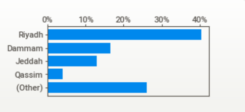
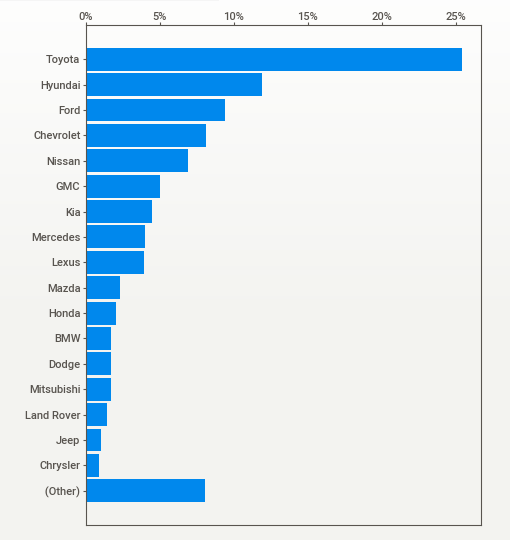
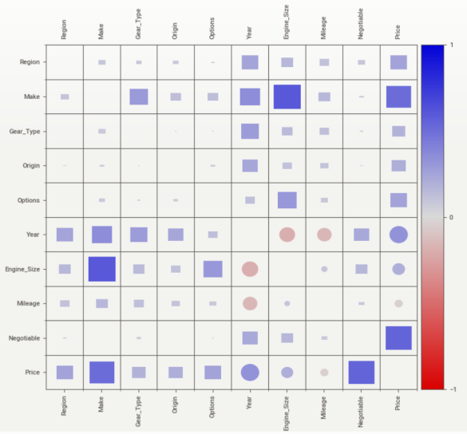
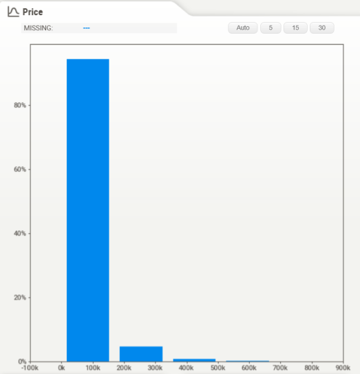
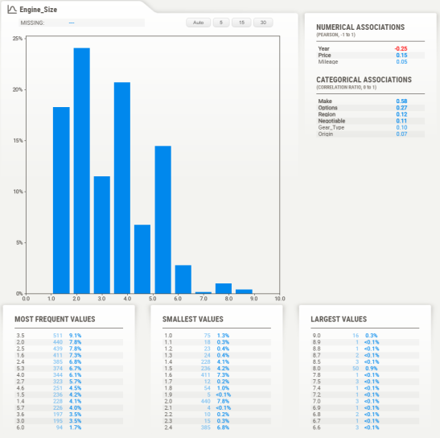

# Usecase 4: Saudi Arabia Used Cars Market Analysis 🚗

## 🔍 Introduction
This project aims to analyze the used car market in Saudi Arabia using data sourced from the "Syarah" website and shared on Kaggle. The analysis involves exploring the data and answering market-related questions to enhance understanding and enable data-driven decisions.

## Project Steps

### 1. Problem Statement Definition
We aim to address the following questions:
1. Which region in Saudi Arabia has the **largest used car market**?
2. During the specified period, **which car brand was listed the most for sale**?
3. What features significantly influence the price of a used car?
4. What is **the price range for used cars approximately four years old**?

### 2. 📊 **Dataset Overview**
Used car data was scraped from the "Syarah" website for the year 2023 and is available on Kaggle. The table below provides a sample of the data:

| #  | Type          | Region         | Make          | Gear Type     | Origin      | Options       | Year | Engine Size | Mileage      | Negotiable | Price    |
|----|---------------|----------------|---------------|---------------|-------------|----------------|-------|------------|---------------|-------------|----------|
| 0  | Corolla       | Abha           | Toyota        | Manual        | Saudi       | Standard       | 2013  | 1.4        | 421,000      | True       | 0        |
| 1  | Yukon         | Riyadh         | GMC           | Automatic     | Saudi       | Full           | 2014  | 8.0        | 80,000       | False      | 120,000  |

### 3. 🔍 **Exploratory Data Analysis (EDA)**
#### **The following steps were applied to the dataset:**
1. **Data Quality Checking & Remediation:**
   - Cleaning the data, handling missing values, and correcting errors.
   - Addressing outliers if necessary.
2. **Exploratory Data Analysis (EDA):**
   - **Univariate Analysis:** Understanding the distribution of individual variables.
   - **Bivariate & Multivariate Analysis:** Identifying relationships between variables.
3. **Data Visualizations:**
   - **5+ different charts** created using:
     - **Matplotlib, Seaborn, Plotly, Delta, Sweetviz**
   - All charts follow a unified style, ensuring:
     - Consistent colors, titles, font sizes, axis labels, and legends.
.

## 4. 📈 **Key Insights & Visualizations**
### **Top 4 Insights from the Analysis (with Visuals):**
  **** 
    •    Riyadh: ~40%  
    •    Dammam: ~15%  
    •    Jeddah: ~10%  
    •    Qassim: ~5%  
    •    Other: ~25%  
______________________________________________________________

**** 
Toyota leads (~25%), followed by Hyundai (~15%). Ford, Chevrolet, and Nissan hold mid-range shares. Luxury brands (Mercedes, Lexus, BMW) have smaller shares. Jeep, Chrysler, and Land Rover rank lowest. Other brands also contribute.  
______________________________________________________________

**** 
Engine_Size and Price have a strong positive correlation (larger engines → higher prices).
Make significantly impacts Price (brand matters).
Year and Price show a moderate positive correlation (newer cars cost more).
Mileage has a slight negative correlation with Price (higher mileage → lower price).
Negotiable prices show some variation but no strong pattern. 
______________________________________________________________

**** 
 Most used cars (around 4 years old) are priced below 100,000, indicating that this price range is the most common in the market. Cars that exceed 100,000 are very rare. 
______________________________________________________________

**** 
 The most common engine sizes in the market are 2.0L and 3.5L, as they have the highest frequency in the histogram. These sizes are popular for their balance between fuel efficiency and performance. 

## Team Members 👩‍💻👨‍💻
- Mushal Al-shagha
- Naser Al-Manaa
- Rahaf Al-Otaibi
- Munirah Al-Zuman
- Raghad Al-Harbi

## Important Links 🔗
- Syarah Website: [syarah.com](https://syarah.com/)
- Kaggle Dataset: [Saudi Arabia Used Car Dataset](https://www.kaggle.com/datasets/raihanmuhith/saudi-arabia-used-car/data)

